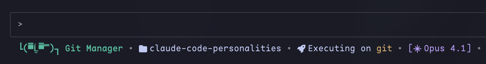

# ૮ ․ ․ ྀིა Claude Code Personalities

> Dynamic text-face personalities for Claude Code's statusline

Give your Claude Code assistant a dynamic, context-aware statusline with 30+ text-face emoticons that change based on Claude's current activity.  
Watch Claude transform from `ʕ•ᴥ•ʔ Code Wizard` when coding to `(┛ಠДಠ)┛彡┻━┻ Frustrated Developer` when encountering errors!

**Powered by Rust** - Lightning fast performance (~1ms statusline generation), zero external dependencies, and interactive configuration!



## Installation

### Quick Install (Interactive)

```bash
# Step 1: Install the CLI tool
curl -fsSL https://raw.githubusercontent.com/Mehdi-Hp/claude-code-personalities/main/install.sh | bash

# Step 2: Configure Claude Code (interactive prompts)
claude-code-personalities install
```

### Installation Options

- `--yes` or `-y`: Non-interactive installation with safe defaults
- `--interactive` or `-i`: Interactive installation (default)
- `NONINTERACTIVE=1`: Environment variable for non-interactive mode

## Updating

Claude Code Personalities includes automatic update checking:

```bash
# Check for updates
claude-code-personalities check-update

# Update to latest version
claude-code-personalities update
```

The statusline will show `[⬆ Update vX.X.X]` when a new version is available.

## Commands

```bash
# Installation
claude-code-personalities install             # Interactive configuration (default)
claude-code-personalities install --yes       # Non-interactive with safe defaults
claude-code-personalities install -y          # Short flag for non-interactive

# Configuration
claude-code-personalities config              # Interactive configuration menu

# Management
claude-code-personalities status              # Check installation status
claude-code-personalities update              # Update to latest version
claude-code-personalities check-update        # Check for available updates
claude-code-personalities uninstall           # Remove personalities
claude-code-personalities help                # Show help with all options
```

## Requirements

- Claude Code v1.0.60+
- Nerd Fonts for icons (`brew install --cask font-hack-nerd-font`)

## Platform Support

### Supported Platforms
- **macOS** (Intel & Apple Silicon)
- **Linux** (x86_64 & ARM64)

### Windows Not Supported
**Windows is not currently supported** due to me not caring about development on windows:
- Uses Unix-style paths (`~/.local/bin`, `/tmp`)
- Relies on Unix file permissions
- Hook system designed for Unix shells

**Windows users:** Consider using WSL2 (Windows Subsystem for Linux) which provides full compatibility.

## Configuration

Customize what appears in your statusline using the interactive configuration:

```bash
claude-code-personalities config
```

This opens a multi-select menu where you can toggle:
- **Show Personality** - Text-face emoticons (ʕ•ᴥ•ʔ, (╯°□°)╯, etc.)
- **Show Activity** - Current activity (editing, coding, debugging, etc.)
- **Show Current Job/File** - Current file being worked on
- **Show Current Directory** - Working directory path
- **Show Model Indicator** - Claude model (Opus, Sonnet, Haiku)
- **Show Error Indicators** - Warning/error icons based on error count
- **Use Icons** - Nerd Font icons for visual appeal
- **Use Colors** - ANSI color formatting

Settings are saved to `~/.claude/personalities_config.json` and take effect immediately.

## Building from Source

For developers:

```bash
git clone https://github.com/Mehdi-Hp/claude-code-personalities
cd claude-code-personalities
cargo build --release

# Binary will be at target/release/claude-code-personalities
```

## License

WTFPL - Do what you want with it.